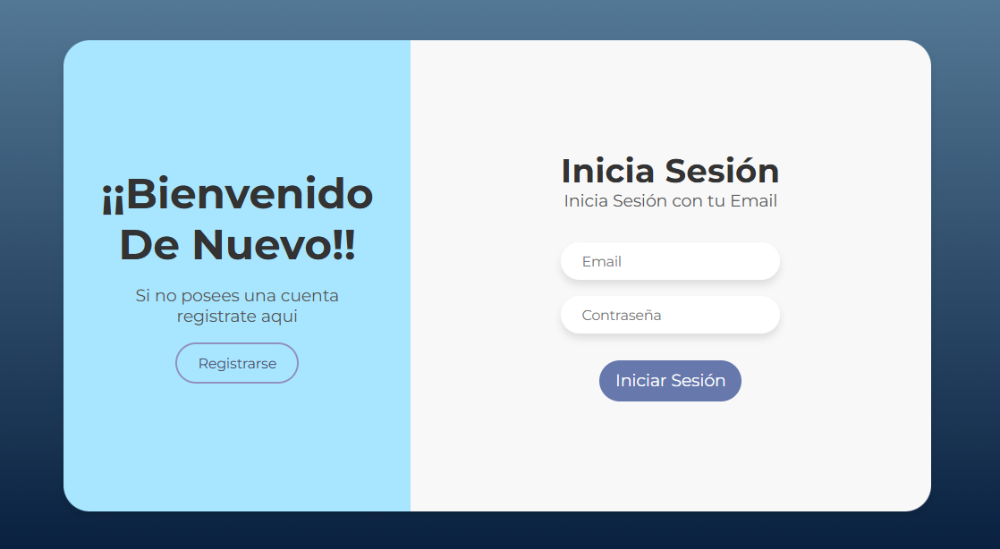
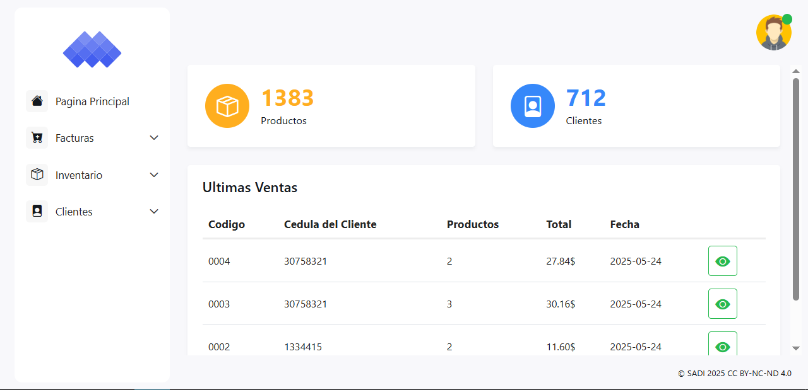
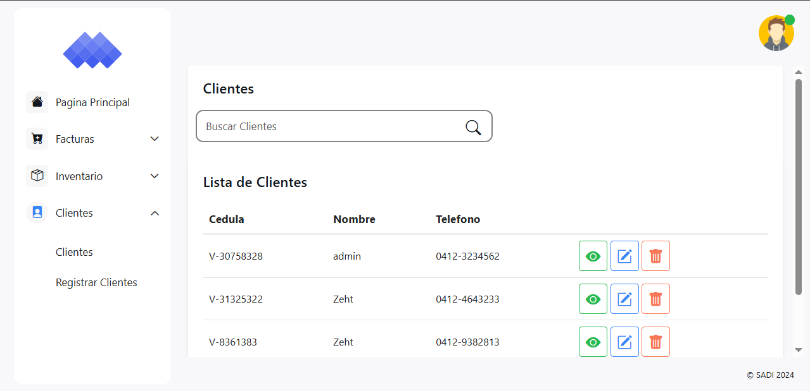
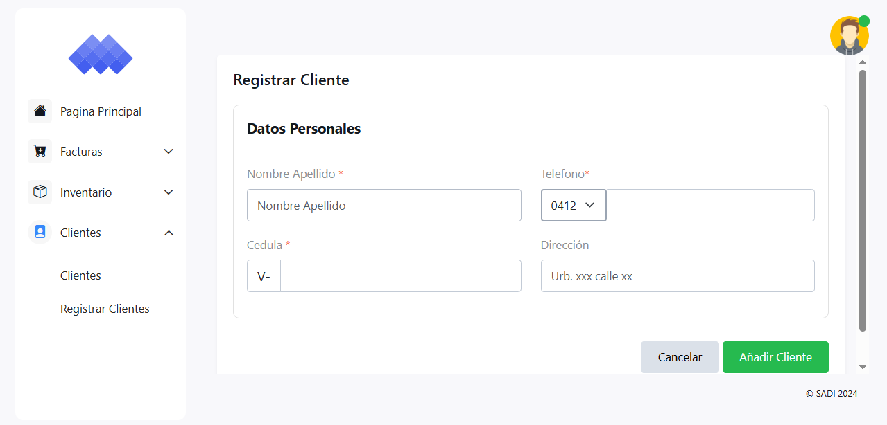
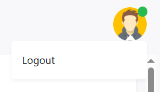
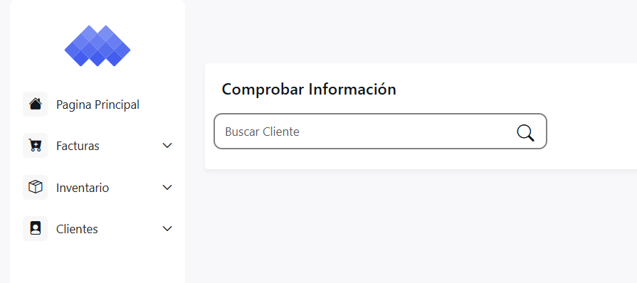
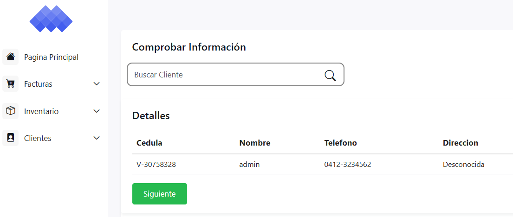
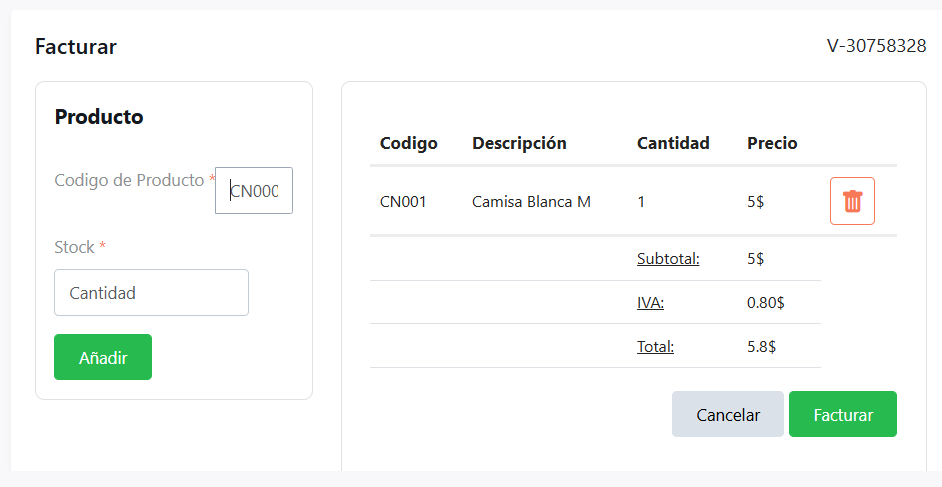
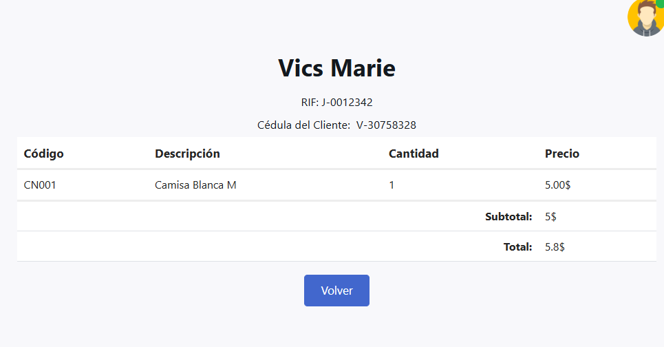

# SADI
#### Sistema para ventas/inventarios de forma facil Y rapida
---
## Tabla de Contenidos
- [Caracteristicas](#caracteristicas)

- [Uso](#uso)

- [Tecnologías Utilizadas](#tecnologias-utilizadas)

- [Licencia](#licencia)

## Caracteristicas
- Interfaz de usuario intuitiva
- insertar, leer, actualizar y eliminar:
    - Clientes
    - Productos
    - Facturas

---

## Uso
#### Login
Inicia Sesion o Registrate

#### Inicio
- Pagina Principal
- Numero de Productos
- Clientes
- Menu (parte izquierda)

#### Cliente
Consulta, modifica y elimina la informacion de uno o mas clientes

#### Icons
Funcionamiento de Iconos

- 1er icono (Verde): Info. Detallada
- 2do icono (Azul): Modificar
- 3er icono (Rojo): Eliminar

#### Agregar Cliente
Añadir un nuevo Cliente al Sistema

#### Logout
Cerrar Sesion al pasar el mouse por el icono despliega la opcion de logout
s

### Nota:
Al mostrar el funcionamiento del apartado Clientes se muestra el funcionamiento de cada apartado excepto Facturar debido a que son el mismo diseño

#### Facturar
Facturar la Compra

1. Comprobar Info. del Cliente

2. Ya Comprobado Proceder a añadir productos

3. Cargar productos por el Codigo e indicar la cantidad a añadir (puede eliminar el producto de la lista)

4. Emision y muestra de Factura

---

### Tecnologias Utilizadas

#### Frontend: Bootstrap 5
#### Backend: PHP | SQL
#### Montaje: XAMPP

---

## Licencia
SADI © 2025 by Kevin Paez is licensed under CC BY-NC-ND 4.0. To view a copy of this license, visit https://creativecommons.org/licenses/by-nc-nd/4.0/
